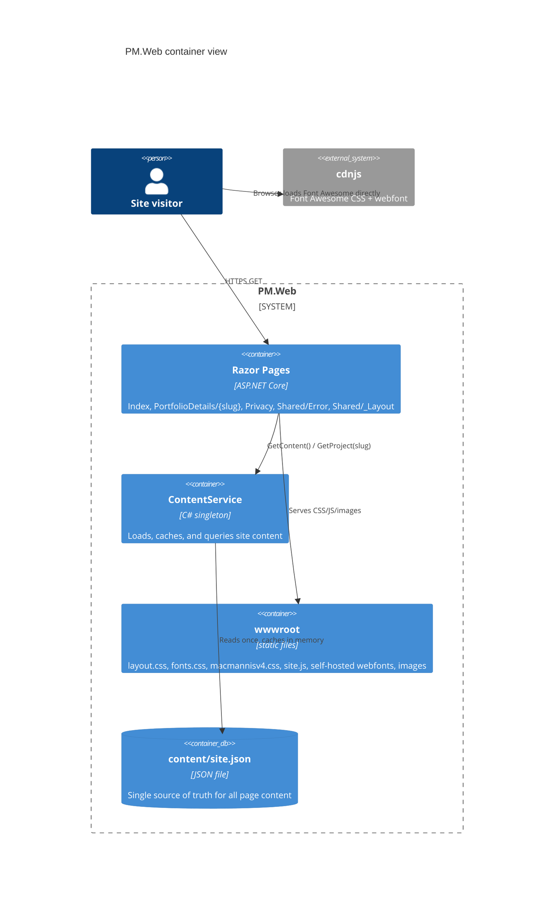
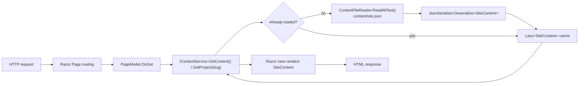

# Architecture

## C4 container view

## Content pipeline

Every page follows the same read path: an incoming request is routed to a Razor Page, the page model asks `IContentService` for data, and `ContentService` serves it from an in-memory cache that it built once from `content/site.json`.

## Key components

- **Hosting** ([Program.cs](../PM.Web/Program.cs)): minimal-hosting `WebApplication`. Registers `AddRazorPages()`, a singleton `IContentFileReader` pointed at `content/site.json` under the app's content root, and a singleton `IContentService`. Pipeline: dev-exception-page or `UseExceptionHandler("/Error")` + HSTS, a rewrite rule that redirects to the `www` host, static files, routing, authorization, then `MapRazorPages()`.
- **Content model** ([Models/Content/](../PM.Web/Models/Content/)): immutable C# records (`SiteContent`, `Hero`, `About`, `Fact`, `SkillItem`, `ResumeSection`, `ExperienceItem`, `Service`, `PortfolioProject`, `Testimonial`, `MediaImage`, `Tag`) that mirror the shape of `content/site.json` field-for-field, deserialized with `System.Text.Json`'s web defaults (camelCase).
- **`ContentService`** ([Services/ContentService.cs](../PM.Web/Services/ContentService.cs)): the only place that reads `site.json`. Loads and deserializes lazily on first access (`Lazy<SiteContent>`), so the file is read at most once per process lifetime (the service is registered singleton). Fails fast: a missing file or malformed JSON throws out of `Load()` instead of being swallowed, and is logged at Error; a successful load logs Information once. `GetProject(slug)` does a case-insensitive linear scan over `Portfolio` and returns `null` for no match, letting the caller decide what "not found" means.
- **Pages** ([Pages/](../PM.Web/Pages/)): `Index` renders every section of `SiteContent` via `foreach` loops (no per-item hardcoding); `PortfolioDetails` routes on `{slug}` and redirects to `Index` when `GetProject` returns null; `Privacy` is static; `Shared/_Layout` injects `IContentService` directly (via `@inject`) to render the hero name/roles and footer, since those appear outside `Index`'s own body; `Shared/Error` is mapped to the fixed route `/Error` to match `UseExceptionHandler("/Error")`.
- **Front end** ([wwwroot/](../PM.Web/wwwroot/)): no jQuery or third-party JS/CSS framework. `site.js` is a single vanilla-JS file covering preloader, typewriter, smooth scroll/scrollspy, mobile nav, back-to-top, `IntersectionObserver`-driven counters/skill-bars/scroll-reveal, a portfolio category filter, a `<dialog>`-based lightbox, and a small custom carousel. `layout.css` supplies the Bootstrap reboot, responsive container, grid, and utility rules the pages use; `fonts.css` declares `@font-face` rules for the self-hosted Open Sans/Raleway/Poppins woff2 files in `wwwroot/fonts/`; `macmannisv4.css` is the original template's component styling, carried forward. Font Awesome is loaded from the cdnjs CDN rather than self-hosted or from FontAwesome's account-linked kit script; see [decisions/0004-fontawesome-via-cdn.md](decisions/0004-fontawesome-via-cdn.md).

## Testing

`PM.Web.Tests` (xUnit + FakeItEasy) covers `ContentService` end to end against a fake `IContentFileReader`: valid-JSON mapping, missing-file and malformed-JSON fail-fast behavior, single-read caching across repeated `GetContent()` calls, and case-insensitive slug lookup including the not-found path.
