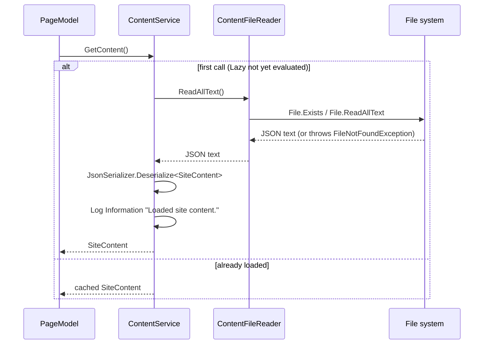

# Content loading

## Purpose

Loads `content/site.json` exactly once per process, deserializes it into the `SiteContent` object graph, and serves it to every page for the lifetime of the app. This is the single source of truth the rest of the app (see [home-page-render.md](home-page-render.md) and [portfolio-details.md](portfolio-details.md)) reads from instead of hardcoded view markup or controller code.

## Entry points

Any call to `IContentService.GetContent()` or `IContentService.GetProject(string slug)`. `ContentService` is registered as a DI singleton in [Program.cs](../../PM.Web/Program.cs), constructed with a singleton `IContentFileReader` pointed at `content/site.json` under `builder.Environment.ContentRootPath`.

## Sequence

## Key behavior

- **Caching**: `ContentService` holds a `Lazy<SiteContent>` ([ContentService.cs:22](../../PM.Web/Services/ContentService.cs)) constructed with the private `Load()` method. `Lazy<T>`'s default thread-safety mode means `Load()` runs at most once even under concurrent first requests; every subsequent `GetContent()` call returns the same cached instance. Because `ContentService` is registered singleton, this cache lives for the whole app lifetime — the app must be restarted to pick up a `site.json` edit.
- **Fail-fast**: `Load()` ([ContentService.cs:64-82](../../PM.Web/Services/ContentService.cs)) does not swallow errors. A missing file surfaces as `FileNotFoundException` from `ContentFileReader.ReadAllText()` ([ContentFileReader.cs:26-29](../../PM.Web/Services/ContentFileReader.cs)); malformed JSON surfaces as whatever `System.Text.Json` throws; a JSON payload that deserializes to `null` is turned into an explicit `InvalidOperationException`. All three are logged at Error via `_logger.LogError(ex, ...)` and then rethrown, so the failure propagates to the caller (and, unhandled, becomes a request failure) rather than being hidden behind a null or default `SiteContent`.
- **Deserialization**: uses `System.Text.Json.JsonSerializer` with `JsonSerializerDefaults.Web` (camelCase property matching), so `content/site.json`'s camelCase keys map directly onto the PascalCase C# record properties in `PM.Web/Models/Content/` with no custom converters or attributes.
- **Lookup**: `GetProject(slug)` ([ContentService.cs:46-62](../../PM.Web/Services/ContentService.cs)) guards against null/whitespace slugs (returns `null` immediately) and otherwise does a case-insensitive (`StringComparison.OrdinalIgnoreCase`) linear scan of `GetContent().Portfolio`, returning the first match or `null`.
- **Testability**: the filesystem is abstracted behind `IContentFileReader` specifically so `ContentService`'s tests (`PM.Web.Tests/ContentServiceTests.cs`) can fake `ReadAllText()` without touching a real file — see the tests for the exact scenarios covered (valid JSON, missing file, malformed JSON, single-read caching, case-insensitive and not-found slug lookup).

## Decisions

- [0002: JSON content via System.Text.Json](../decisions/0002-json-content-via-system-text-json.md)

## Source references

`PM.Web/Services/ContentService.cs`, `PM.Web/Services/IContentService.cs`, `PM.Web/Services/ContentFileReader.cs`, `PM.Web/Services/IContentFileReader.cs`, `PM.Web/content/site.json`, `PM.Web/Program.cs` (DI registration), `PM.Web.Tests/ContentServiceTests.cs`.

## Failure modes and edge cases

- Missing `content/site.json` at the resolved path: `FileNotFoundException`, logged and rethrown.
- Malformed JSON: `JsonException` (or similar from `System.Text.Json`), logged and rethrown.
- JSON that parses to `null` (e.g. the literal `null` as file content): `InvalidOperationException`, logged and rethrown.
- Unknown or null/whitespace slug passed to `GetProject`: returns `null`, does not throw.
- Concurrent first-request access: `Lazy<SiteContent>`'s default mode ensures `Load()` executes once; the other concurrent caller(s) block until the first completes, then all receive the same result (or the same exception, since `Lazy<T>` caches faulted state too by default).
