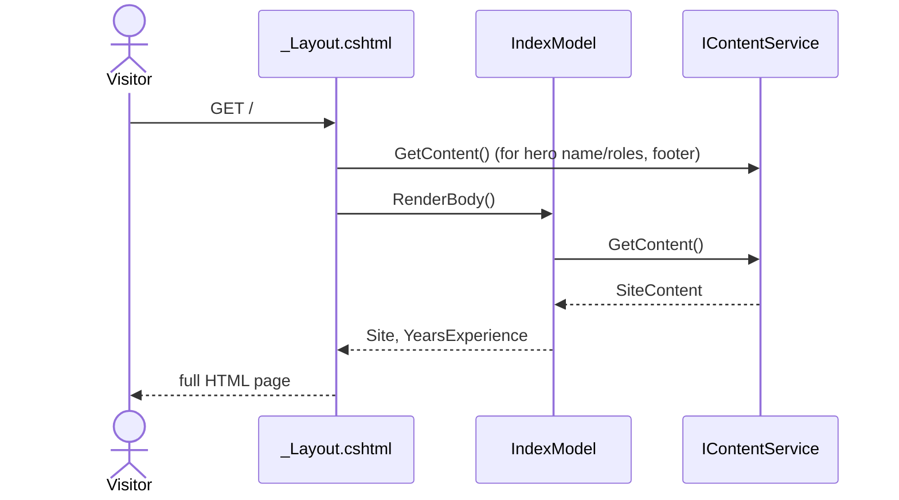

# Home page render

## Purpose

Renders the single-page portfolio (hero, about, facts, skills, resume, portfolio grid, services, testimonials) entirely from `SiteContent`, with no hardcoded per-item markup. This is the flow that replaced the old MVC view's inline HTML plus the controller's 160-line project switch.

## Entry points

`GET /` and `GET /Index`, routed by Razor Pages convention to `Pages/Index.cshtml` / `IndexModel.OnGet()` ([Index.cshtml.cs](../../PM.Web/Pages/Index.cshtml.cs)).

## Sequence

## Key behavior

- `IndexModel.OnGet()` ([Index.cshtml.cs:40-44](../../PM.Web/Pages/Index.cshtml.cs)) fetches `SiteContent` once via `_contentService.GetContent()` and computes `YearsExperience` as `DateTime.Now.Year - Site.About.StartYear` — the "N years of professional experience" figure is derived at request time, not stored as a static number in `site.json`.
- `Index.cshtml` loops over every collection in `SiteContent` (`Facts`, `Skills`, `Resume.Experience`, `Portfolio`, `Services`, `Testimonials`) with `foreach`, so adding, removing, or reordering an item in `content/site.json` changes the rendered page with no code change.
- The resume summary supports the `{years}` token; `Index.cshtml` replaces that token with `YearsExperience`, then renders `Resume.SpeakingEngagements.Description` and its `Bullets` directly under the summary block.
- Resume education is structured as `major`, `minorOrCertificate`, `period`, and `location`; the first two render as separate `h4` lines, followed by the period and location in the same visual pattern as experience entries.
- Resume timeline spacing is intentional: summary and education use the base `.resume-item` without bottom padding, while professional experience entries add `.resume-item-experience` to keep the spacing between repeated roles. Experience entries can include an optional `subtitle`, rendered below the organization/location line for context such as acquisition history.
- Fact counter spans emit each fact's `durationSeconds` value as `data-duration-ms`; `wwwroot/js/site.js` uses that value to control each count-up animation duration. The Facts section renders the computed years-of-experience box plus configured facts in a CSS grid that shows five boxes across on large screens and wraps responsively below that.
- The hero background uses `#hero:before` as a translucent overlay; `#hero .container` is positioned above that overlay so the hero name, typed text, and social links retain the intended contrast.
- `_Layout.cshtml` renders the shared social links in both the hero and footer. LinkedIn and GitHub use Font Awesome brand icons; EveryExpert uses the published EveryExpert SVG mark inline, with `.social-links a svg` sizing it from the same font-size rules as the icon font links.
- Per-skill years (`skillYears`) are computed in the view as `currentYear - skill.StartYear`, floored at zero for future-dated content, so each key technology shows years since that technology's own start year. The skills list uses a responsive CSS grid with a mobile-safe column minimum, zero default list spacing, and explicit item gaps so the list stacks without reserving desktop-width space on narrow viewports.
- Scroll reveal is fail-open: `data-aos` content is visible by default, then `site.js` adds `scroll-reveal-ready` to enable reveal transitions only after JavaScript initializes. Reveal uses a zero-threshold `IntersectionObserver` so tall sections, especially the resume on mobile, become visible as soon as any part of them enters the viewport.
- `layout.css` carries the Bootstrap reboot rules that affect page rhythm, including heading, paragraph, and list margins; this keeps section spacing aligned with the pre-redesign Bootstrap-rendered site.
- The Services section's decorative SVG icon backgrounds are not content data; they are looked up in the view by `service.ColorClass` via a local `@functions` helper (`ServiceIconBlob`), because they are presentational, not informational.
- `_Layout.cshtml` injects `IContentService` directly (`@inject`) to read `Hero` for the hero section and footer, since both live outside `Index`'s own `@RenderBody()` content and are shared across every page that uses this layout.
- Portfolio cards use `data-filter` values (`filter-web`, `filter-app`, `filter-db`) derived from `project.Category` in the view; the client-side filter in `site.js` reads these attributes (see [content-loading.md](content-loading.md) for how the underlying data arrives, and `wwwroot/js/site.js` for the filter implementation).

## Decisions

- [0001: Razor Pages over MVC](../decisions/0001-razor-pages-over-mvc.md)
- [0002: JSON content via System.Text.Json](../decisions/0002-json-content-via-system-text-json.md)
- [0003: Vanilla front end, no jQuery](../decisions/0003-vanilla-front-end-no-jquery.md)

## Source references

`PM.Web/Pages/Index.cshtml`, `PM.Web/Pages/Index.cshtml.cs`, `PM.Web/Pages/Shared/_Layout.cshtml`, `PM.Web/Models/Content/SiteContent.cs` and its nested records.

## Failure modes and edge cases

If `content/site.json` is missing or malformed, `ContentService.GetContent()` throws (see [content-loading.md](content-loading.md)); there is no fallback content, so the page will fail rather than render a partial/empty page. The `_gs` GoSquared analytics snippet and Font Awesome CDN `<link>` in `_Layout.cshtml` are the only network calls outside the app itself; there is no error handling around either failing to load (the page still renders, just without icons/analytics).
