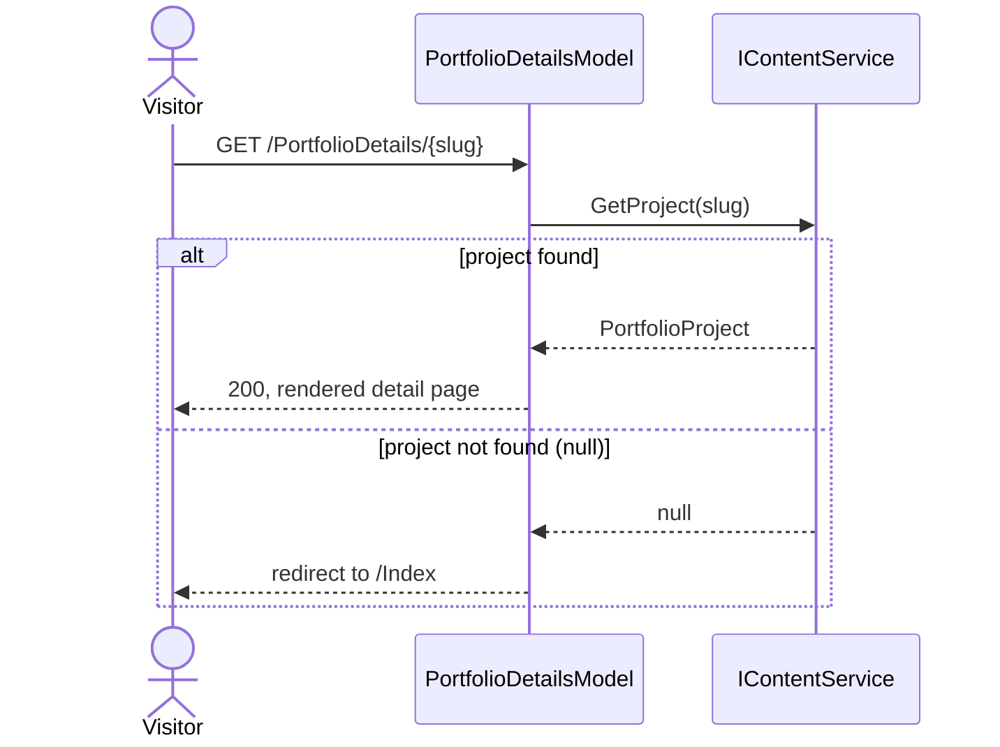

# Portfolio details

## Purpose

Shows the full detail view for one portfolio project (client, category, date, project URL, description paragraphs, image carousel, tags) given its slug. Replaces the old `HomeController.PortfolioDetails` action and its `switch` over six hardcoded `ProductDetailsVM` instances.

## Entry points

`GET /PortfolioDetails/{slug}`, routed via the explicit page route `@page "{slug}"` in [PortfolioDetails.cshtml](../../PM.Web/Pages/PortfolioDetails.cshtml), handled by `PortfolioDetailsModel.OnGet(string slug)` ([PortfolioDetails.cshtml.cs](../../PM.Web/Pages/PortfolioDetails.cshtml.cs)).

Note this route intentionally differs from the pre-redesign app's `/Home/PortfolioDetails/{slug}` (the old MVC controller route); there is no redirect from the old path, by design (see the ADR list below has no entry for this because it was a direct, undocumented-as-ADR call made during the redesign, not a standing decision — flagged here for the human reviewer rather than silently omitted).

## Sequence

## Key behavior

- `OnGet` ([PortfolioDetails.cshtml.cs:38-50](../../PM.Web/Pages/PortfolioDetails.cshtml.cs)) calls `_contentService.GetProject(slug)`; a `null` result redirects to the `Index` page (`RedirectToPage("Index")`) rather than returning a 404, matching the original controller's `_ => RedirectToAction("Index")` fallback behavior.
- `GetProject` (in `ContentService`, see [content-loading.md](content-loading.md)) matches case-insensitively, so `/PortfolioDetails/TP` and `/PortfolioDetails/tp` both resolve to the same project.
- The view (`PortfolioDetails.cshtml`) sets `Layout = null` and renders its own complete `<html>` document rather than using `Shared/_Layout.cshtml` — this was true before the redesign as well, and is unchanged, so the details page loads its own copy of the Font Awesome CDN link, self-hosted font CSS, `layout.css`, `macmannisv4.css`, and `site.js` rather than inheriting them from the shared layout.
- The image carousel and lightbox both reuse the same `wwwroot/js/site.js` behaviors as the home page's testimonials carousel and portfolio lightbox (`.carousel`/`.carousel-track`/`.carousel-slide` markup, `data-lightbox` trigger attribute).
- Tag rendering branches on `tag.Color`: a non-empty color renders an inline `style` with that background color; an empty/missing color falls back to the `badge-primary` CSS class.

## Decisions

- [0001: Razor Pages over MVC](../decisions/0001-razor-pages-over-mvc.md)

## Source references

`PM.Web/Pages/PortfolioDetails.cshtml`, `PM.Web/Pages/PortfolioDetails.cshtml.cs`, `PM.Web/Models/Content/PortfolioProject.cs`, `PM.Web/Models/Content/MediaImage.cs`, `PM.Web/Models/Content/Tag.cs`.

## Failure modes and edge cases

- Unknown slug (including empty/whitespace, per `ContentService.GetProject`'s guard) redirects to `Index` rather than erroring or 404ing.
- If `content/site.json` fails to load at all, `GetProject` never gets a chance to run its own logic — the underlying `GetContent()` call throws first (see [content-loading.md](content-loading.md)).
