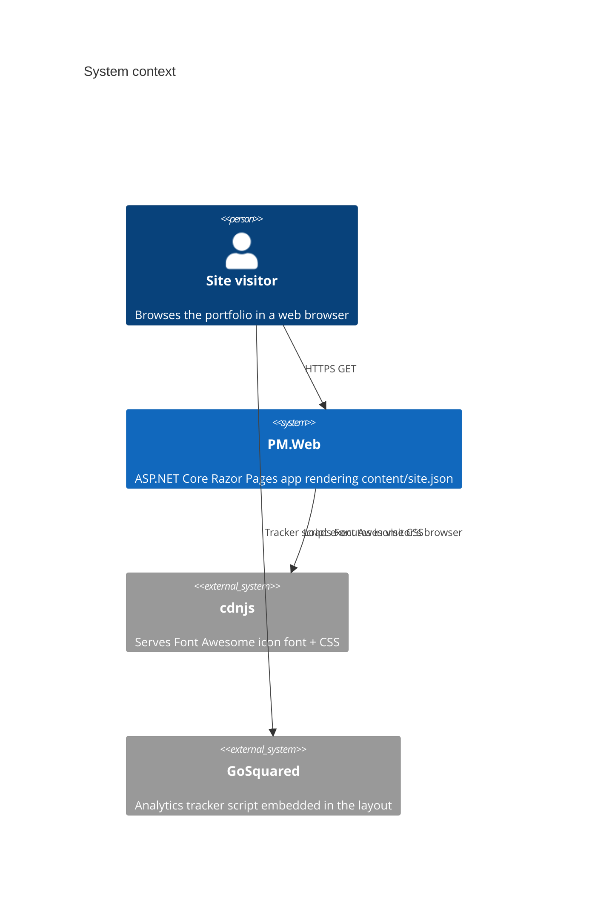

# Overview

## What this application is

`PM.Web` is Pat MacMannis's personal portfolio website (macmannis.com): a one-page site presenting his professional background, skills, resume, past projects, services offered, and testimonials, plus a per-project details page. It is a static-content brochure site with no database, no user accounts, and no write path — every page is a read-only render of a single content file.

## Who uses it

Prospective clients, employers, and colleagues browsing macmannis.com. There are no other consuming systems, scheduled jobs, or partner integrations.

## System context

## Boundaries

In scope: rendering the home page (about, facts, skills, resume, portfolio, services, testimonials) and per-project portfolio detail pages from `content/site.json`, served over HTTPS with a `www` redirect.

Out of scope (not built yet, though config for it exists): a contact form and a blog. `appsettings.*.json` already carries `CaptchaClientKey` and SendGrid/reCAPTCHA settings for a future contact form, but no page or endpoint uses them today — see [content-loading.md](flows/content-loading.md) and the source at [Program.cs](../PM.Web/Program.cs) for what is actually wired up.

## Where to go next

- [Architecture](architecture.md) for the internal shape.
- [Flows](flows/index.md) for end-to-end behavior.
